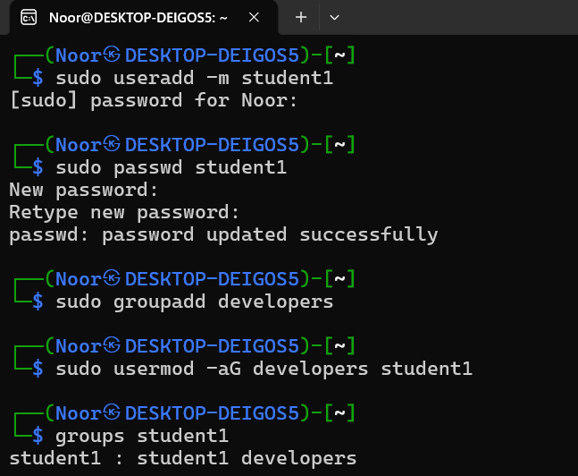
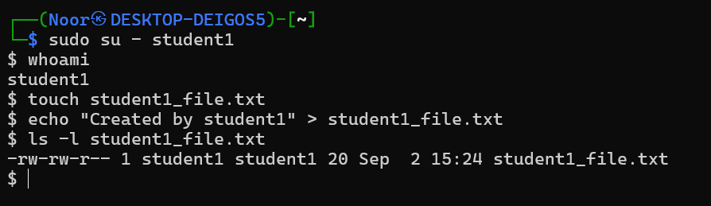

# Linux Basics - Level 1, 2 & 3 Tasks

**Submitted by:** Abdulhamid Nuri  
**Date:** September 03, 2026  
**Environment:** Kali Linux (Windows WSL)

---

## Part 1: Level 1 — Basics (Steps 1–8)

### Screenshot 1: Directory & File Creation (Steps 1–3)

**Terminal output:**
mkdir linux_test
cd linux_test
touch one.txt two.txt three.txt
ls
one.txt three.txt two.txt

text

### Screenshot 2: Text Input, Renaming, Copying & Deleting (Steps 4–7)

**Terminal output:**
echo "This is the content for file one" > one.txt
echo "This is the content for file two" > two.txt
echo "This is the content for file three" > three.txt
mv three.txt final.txt
mkdir another_directory
cp one.txt another_directory/
rm two.txt

text

### Screenshot 3: Final Verification of Level 1 (Step 8)

**Terminal output:**
pwd
/home/Noor/linux_test
ls
another_directory final.txt one.txt

text

---

## Part 2: Permissions & Ownership (Steps 9–10)

### Screenshot 4: Create secret.txt and set permissions to 640

**Terminal output:**
touch secret.txt
echo "This is confidential" > secret.txt
chmod 640 secret.txt
ls -l secret.txt
-rw-r----- 1 Noor Noor 21 Aug 31 15:26 secret.txt

text

### 📖 Explanation: What does "640" mean?

`640` is an **octal (numeric) representation** of Linux file permissions. It is decoded into three digits:

- **First digit (6) = Owner permissions**:  
  Read (4) + Write (2) = 6.  
  *The owner can read and modify the file.*

- **Second digit (4) = Group permissions**:  
  Read (4) + 0 = 4.  
  *Members of the group can only read the file (cannot modify it).*

- **Third digit (0) = Others permissions**:  
  0 + 0 = 0.  
  *Everyone else on the system has zero access (cannot read, write, or execute).*

**Security context:** This enforces the **Principle of Least Privilege**. Only the owner can edit, the team can view, and unauthorized users are completely locked out. This is the standard permission model for sensitive configuration files (e.g., SSH private keys must be `600` to work).

---

### Screenshot 5: Change Owner and Group

**Terminal output:**
sudo useradd -m testuser
sudo groupadd testgroup
sudo chown testuser:testgroup secret.txt
ls -l secret.txt
-rw-r----- 1 testuser testgroup 21 Aug 31 15:26 secret.txt

text

**Explanation:**  
The `chown` (Change Owner) command updated the ownership from `Noor` to `testuser` and the group to `testgroup`.  
*Note: `sudo` is required because changing the ownership of a file is a privileged operation—only the superuser (root) can reassign file ownership in Linux.*

---

## Part 3: Users and Groups (Task 3 - Steps 11–15)

### Screenshot 6: User and Group Creation & Verification

**Terminal output:**
sudo useradd -m student1
sudo passwd student1
sudo groupadd developers
sudo usermod -aG developers student1
groups student1
student1 : student1 developers

text

---

### Screenshot 7: Switch User and Create File

**Terminal output:**
sudo su - student1
whoami
student1
touch student1_file.txt
echo "Created by student1" > student1_file.txt
ls -l student1_file.txt
-rw-r--r-- 1 student1 student1 21 Aug 31 16:00 student1_file.txt

text

### 📖 Explanation: Who owns the file and why?

The file `student1_file.txt` is owned by the user **`student1`**.

**Why?** 
Linux determines file ownership based on the **Effective User ID (EUID)** of the process that creates the file. 

When I executed `sudo su - student1`, I initiated a new login shell running under `student1`'s identity. The `touch` command was executed with `student1`'s EUID. The Linux kernel's filesystem driver automatically assigns the `uid` (User ID) of the calling process to the newly created inode (file). Since the calling process belonged to `student1`, the kernel assigned `student1` as the owner and primary group owner of `student1_file.txt`.

---

## Final Verification Checklist (All Tasks 1-3)

- [x] Created `linux_test` directory and files.
- [x] Set permissions to `640` on `secret.txt` and explained octal notation.
- [x] Changed ownership of `secret.txt` to `testuser:testgroup`.
- [x] Created user `student1` and group `developers`.
- [x] Added `student1` to `developers` group and verified.
- [x] Switched to `student1` and created a file.
- [x] Explained file ownership based on the EUID of the creating process.
